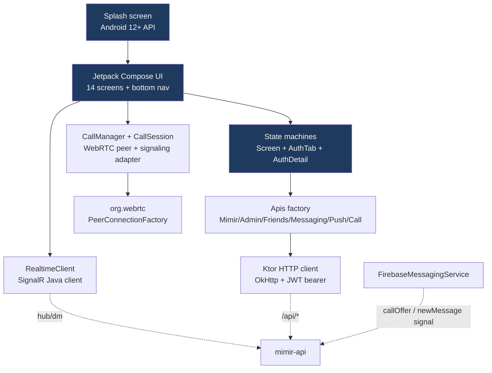

# Mimir — Android

> Android client for **Mimir**, a self-hosted invite-only messaging network. **Kotlin** + **Jetpack Compose**, real-time DM, ephemeral WebRTC voice calls, FCM push, sideload auto-update.
> Named after the Norse keeper of the well of wisdom.

[](https://aykutonpc.com/mimir/health)
[](LICENSE)
[](https://github.com/Aykuttonpc/mimir-mobile/actions)
[](https://developer.android.com/about/versions/nougat)

## ✨ Features

- 💬 **Real-time DM** — SignalR push (typing indicator, edit, soft-delete, read receipts)
- 🟢 **Presence** — friend online/offline + last-seen with pulsing avatar dot
- 🔍 **Local search** — in-memory filter on chats & friends
- 🔔 **FCM push** — wake-up on locked screen, rich notification (sender + content preview)
- 📞 **Voice call** — WebRTC P2P + TURN fallback; full-screen call UI with speaker/mic toggle
- 🌓 **Material 3 theme** — light/dark/system, Norse brand palette (deep blue + rune amber)
- 🎨 **Custom adaptive icon** — Mannaz rune (M) with amber glyph drop
- ⬇️ **In-app auto-update** — sideload APK + force-update gate (HTTP 426)
- 🔐 **Closed-network** — friend-key approval (no public discovery)
- 🚀 **CI/CD** — GitHub Actions: push → debug APK build + VPS upload + force-update env

## 📸 Screens

| Login | Chats | Call |
|---|---|---|
| _(coming soon)_ | _(coming soon)_ | _(coming soon)_ |

## 🏗️ Architecture



## 🧰 Stack

| Layer | Tech |
|---|---|
| Language | Kotlin 2.1, Coroutines, Flow |
| UI | Jetpack Compose, Material 3, DataStore Preferences |
| Network | Ktor 3.0 (OkHttp engine), kotlinx-serialization |
| Real-time | Microsoft SignalR Java client 8.0 |
| WebRTC | `io.github.webrtc-sdk:android` 114.5735 |
| Push | Firebase Messaging KTX (BOM 33.7) — **only `firebase-messaging`**, no Auth/Firestore/Storage |
| Splash | androidx.core:core-splashscreen 1.0 |
| Build | AGP 8.7, Java 17 (Android Studio JBR), Gradle 8.10 |
| Lint | Compose lint defaults |
| Min/Target SDK | 24 / 34 |

## 🚀 Quick Start

```bash
# 1. Clone
git clone https://github.com/Aykuttonpc/mimir-mobile.git
cd mimir-mobile

# 2. Firebase setup (FCM push)
# Firebase Console → Add Android app (package: com.aykutcincik.mimir) → download
# Save: app/google-services.json

# 3. Build debug APK (uses deterministic mimir-debug.keystore committed to repo)
./gradlew :app:assembleDebug

# 4. Install
adb install app/build/outputs/apk/debug/app-debug.apk
```

> The repo ships with a **stable debug keystore** (`app/mimir-debug.keystore`) so every CI build signs identically — APK updates install seamlessly without uninstall. Production release builds need a separate keystore (Sprint #14+).

## 🎨 Theme & Brand

Norse mythology vibe — **deep nordic blue + rune amber + ember copper**. Mannaz rune (ᛗ) symbolizes humanity & wisdom.

```
Light: #1E3A5F (deep nordic blue) + #B08544 (rune amber)
Dark:  #8FB4DC (frost blue)        + #E5C589 (warm amber)
```

## 📚 Architecture Decisions

Documented in [`.claudeteam/DECISIONS.md`](.claudeteam/DECISIONS.md). Key mobile ADRs:

- **ADR-007** Path-prefix routing (`https://aykutonpc.com/mimir/`)
- **ADR-008** Separate backend + mobile repos
- **ADR-015** Backend-authoritative version gate + in-app sideload update
- **ADR-016** Friend-key approval friendship
- **ADR-017** FCM signal-only push (content stays on backend)
- **ADR-019** WebRTC voice call: GetStream baseline adopted

## 🛡️ Security Highlights

- HTTPS-only (`usesCleartextTraffic=false`)
- DataStore token storage (Android internal storage, app-private)
- WebRTC media is end-to-end DTLS-SRTP encrypted (DM and call content never decrypted by FCM/TURN)
- Sensitive files gitignored: `.env*`, `secrets/`, `*.jks`, `*.keystore` (debug keystore is the only explicit exception)
- `mimir-debug.keystore` is **debug-only**; production release builds use a separate keystore

## 🔄 CI/CD

GitHub Actions workflow at [`.github/workflows/deploy-apk.yml`](.github/workflows/deploy-apk.yml):

1. **Push to master** → JDK 17 + Gradle cache → `assembleDebug` → APK
2. SCP to VPS `/opt/mimir/apks/`
3. Update `.env.prod` (LATEST_APP_VERSION_ANDROID + URL)
4. Optional `force=true` dispatch → also bumps MIN_APP_VERSION_ANDROID (old APKs get HTTP 426)
5. Healthcheck on backend container, fail → no env mutation

## 🔌 Backend Companion

ASP.NET Core 9 backend: [mimir-api](https://github.com/Aykuttonpc/mimir-api)

## 📄 License

MIT — see [LICENSE](LICENSE).

## 🙏 Acknowledgments

- WebRTC PeerConnection wrapper + signaling pattern adapted from [**GetStream/webrtc-in-jetpack-compose**](https://github.com/GetStream/webrtc-in-jetpack-compose) (Apache 2.0).
- The pre-compiled WebRTC binary [`io.github.webrtc-sdk:android`](https://github.com/webrtc-sdk/android) (BSD).
- FCM/Firebase trademarks owned by Google. Mimir uses only `firebase-messaging` — Firebase Auth/Firestore/Storage **not used** (ADR-002, ADR-017).
